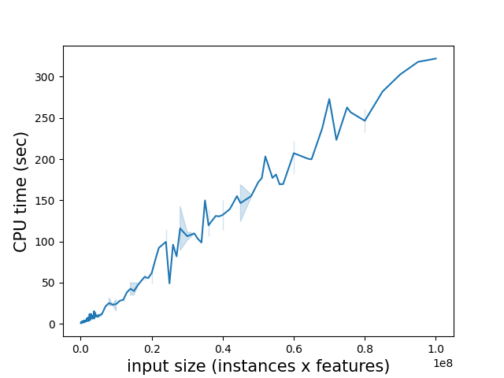
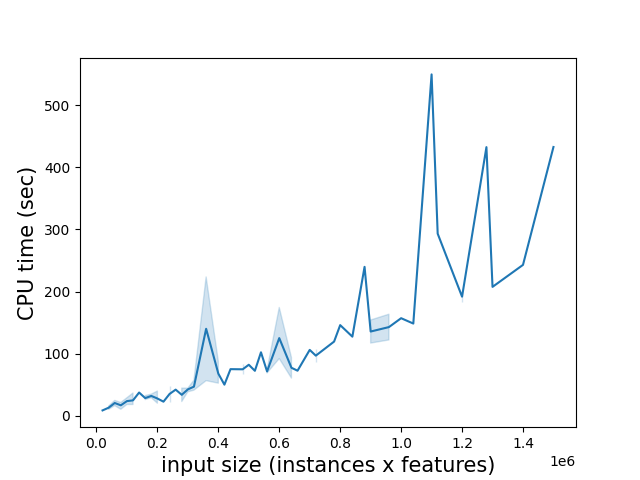
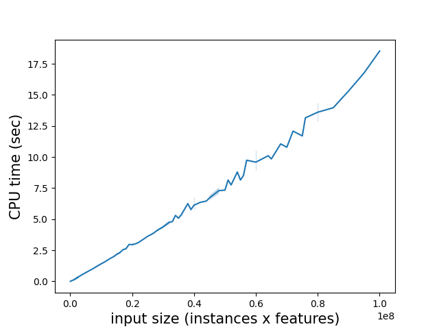
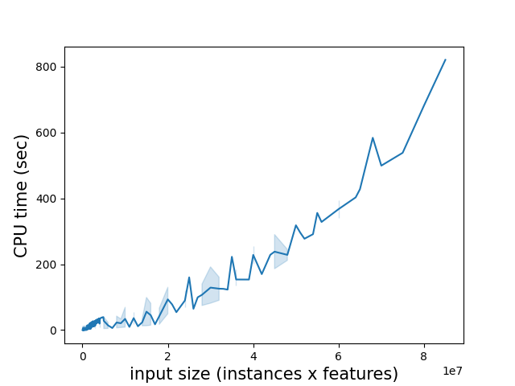

# Summary

Multivariate analysis is a powerful technique that allows researchers to analyze and interpret data with multiple variables.
In today's data-driven world, multivariate analysis has become essential for the exploration of complex data sets.
libscientific is a powerful library written in C that provides a comprehensive set of multivariate analysis tools based on the NIPALS algorithm.
The library includes several multivariate analysis algorithms, such as principal component analysis (PCA), 
partial least squares regression (PLS), consensus principal component analysis (CPCA), multiblock principal component analysis,
and multiblock partial least squares (UPLS). libscientific also includes several other tools to analyze data, such as
cluster analysis using KMeans Hierarchical clustering and other methods to run linear algebra calculations.
The library also provides a Python foreign function to be used inside Python scripts.

# Statement of need

The library is designed to be easy to use and can be integrated into any C or C++ project.
Additionally, libscientific comes with a foreign function Python bindings, making it accessible within Python scripts and easier to perform data analysis tasks.
One of the main advantages of libscientific is its performance and scalability. 
This means that large data sets can be analyzed quickly and efficiently, making it an ideal choice for applications where speed is critical.
The library depends only on lapack for SVD and eigenvalues decomposition and can be easily integrated into embedded systems.
The current library version is 1.5.2, and here is a list of the current library features:

* Principal Component Analysis (PCA)
* Consensus Principal Component Analysis (CPCA)
* Partial Least Squares (PLS)
* Multiple Linear Regression (MLR)
* Unfold Principal Component Analysis (UPCA)
* Unfold Partial Least Squares (UPLS)
* Fisher Linear Discriminant Analysis (LDA)
* Kmeans++ Clustering
* Hierarchical Clustering
* Sample selection algorithms: Most Descriptive Compound (MDC), Most Dissimilar Compound (MaxDis)
* Statistical measures: R2, MSE, MAE, RMSE, Sensitivity, PPV
* Yates Analysis
* Receiver Operating Characteristic curve anaysis (ROC)
* Precision-Recal curve analysis
* Matrix-matrix Euclidean, Manhattan, Cosine and Mahalanobis distances
* Numerical integration
* Natural cubic spline interpolation and prediction
* Linear algebra (Eigenvector/value and SVD operated by Lapack library)
* Ordinary Least Squares solver
* Linear equation Solver
* Nelder-Mead Simplex Optimization
* Cross validation methods: Bootstrap k-fold, Leave-One-Out, Y-Scrambling

libscientific was designed to analyze any kind of multivariate tabular data and to be applied in any scientific field.

# State of The field

The primary objective of libscientific is to offer a library capable of performing multivariate analysis by implementing the NIPALS algorithm. This choice stems from the limitations of prevailing popular libraries like scikit-learn, which need help handling missing and noisy data effectively [@LittleRubin1987;@Qifa2005]. Notably, the NIPALS algorithm is a robust solution to these challenges, addressing issues related to data incompleteness without necessitating prior data imputation.
Furthermore, the NIPALS algorithm conducts iterative computations of components and latent variables, leading to more efficient use of memory resources than alternative methods found in scikit-learn. Notably, it demonstrates superior computational efficiency, especially when researchers seek to analyze only a select few of the foremost principal components or latent variables.
In summary, libscientific aims to provide a sophisticated solution for multivariate analysis, leveraging the NIPALS algorithm's strengths to surmount issues related to missing and noisy data, optimize component calculations, and enhance computational efficiency in scenarios where the analysis focuses on a limited number of critical principal components or latent variables.

# Multivariate analyisis algorithms specs

Principal component analysis (PCA) is one of the most commonly used methods for multivariate analysis. PCA is an unsupervised method that compresses data into low-dimensional representations that capture the dominant variation in the data. libscientific provides a robust implementation of PCA using the NIPALS algorithm described in Geladi paper [@Geladi86]. libscientific implementation can handle data sets with many variables, few instances, and missing values.

Partial least squares (PLS) is another commonly used method for multivariate analysis. PLS is a supervised method that captures the dominant covariation between the data matrix and the target/response. libscientific provides one version of PLS described by Geladi et al [@Geladi86]. This implementation works with single-task and multi-task regression problems.

In addition to PCA and PLS, libscientific provides implementations of Consensus PCA (CPCA) to analyze time series and multi-block data, algorithm described in the Westerhuis paper [@Westerhuis98], and other multi-block methods such as Unfold Principal Component Analysis (UPCA) and Unfold Partial Least Squares (UPLS) both implementation from Wold et al [@SWold87].

All multivariate algorithms admit missing values since the core linear algebra functions are coded to skip missing values, according to Martens et al (page 381) [@Martens2001].

# Other algorithms

The library also provides compound selection algorithms such as Most Descriptive Compounds [@Hudson96] or Most Dissimilar Compound [@Holliday1996] selections, allowing one to analyze scores plots or original data matrices and select samples based on the object/sample diversity.
Moreover, multi-thread cross-validation methodologies such as "Bootstrap k-fold" Leave-One-Out (LOO), and Y-Scrambling tests are implemented to facilitate the scientist in testing model prediction abilities.

# Algorithm stability

Since we are dealing with numerical analysis, unit tests are crucial to ensure correctness, stability, and reproducibility.
Libcientific tests range from simple matrix-vector multiplication to the correctness of complex algorithms using ad-hoc torture toy examples.

# Speed and Memory Comparison

Several simulations of every algorithm in libscientific with data of different sizes (input size) against CPU speed were performed to address the algorithm's performance.
Looking at the plots for PCA, CPCA, and PLS in Figure 1, we observe a linear trend, which suggests that the algorithm's time complexity also increases linearly. However, this does not tell the computational complexity of the algorithms. Indeed, the NIPALS algorithm is reported to have a computational complexity of O(n²) or O(n³), and it is mainly influenced by the number of samples, the number of iterations required for convergence, and the number of principal components/latent variables to calculate.
Instead, MLR shows a polynomial correlation as expected from the OLS algorithm, which uses a matrix direct inverse approach with a computational complexity of O(n³).

With this analysis, we confirm that as the input size (often termed "problem size") increases by a constant factor, the execution time also increases proportionally (linear algorithms).
Linear algorithms have notable characteristics:

* Most of the time, 'Linear Time Complexity (O(n))': Execution time grows linearly with input size.
* Constant Work per Input Element: Each input element is processed continuously in linear algorithms.
* Stable Performance Impact: Doubling input size roughly doubles execution time, facilitating performance estimation.
* Optimal Scaling: Linear-time solutions efficiently handle larger inputs.
  
|   |   |
|---|---|
| PCA | CPCA |
| { width=40% } | { width=40% } |
| PLS | MLR |
| { width=40% } | { width=40% } |

<small>Figure1: Speed performances of 4 different algorithms: Principal Component Analysis (PCA), Partial Least-Squares (PLS), Consensus Principal Component Analysis (CPCA), and Multiple Linear Regression (MLR). Simulations reveal linear trends for PCA, CPCA, and PLS, hinting at probable linear time complexity. However, it is worth mentioning that the NIPALS algorithm, influenced by sample size, iterations, and latent variables, boasts a reported O(n²) or O(n³) complexity. Meanwhile, MLR exhibits a polynomial correlation akin to the OLS matrix approach with O(n³) complexity.</small>

# Usage

For the usage in C or either Python we invite reading the official documentation located at the following link: [http://gmrandazzo.github.io/libscientific/]( http://gmrandazzo.github.io/libscientific/)

# Conclusions

libscientific offers a potent suite of multivariate analysis tools that greatly enhance the ability of researchers and analysts to extract valuable insights from diverse tabular data. With its robust C-based implementation and seamless Python bindings, the library balances high performance and user-friendliness, making it an optimal solution for swiftly executing data-driven applications.

Incorporating libscientific into analytical workflows may empower professionals to leverage various multivariate techniques to crack complex relationships and patterns within datasets. By offering tools for data reduction, predictive modeling, quality control, and more, as already demonstrated in previous works in -omics science and predictive modeling [@Randazzo16;@Randazzo171;@Randazzo172;@Randazzo20;@Kwon21;@Kwon22], the library can be an indispensable asset for tackling intricate challenges across various disciplines.

# Acknowledgements

Libcientific was born as an open-source project from the Ph.D. thesis of the author Giuseppe Marco Randazzo.
The author acknowledges the support from the University of Perugia, the valuable code review made by the people from Freaknet Medialab, and the bug reports from the whole open-source community using this library.

# References
